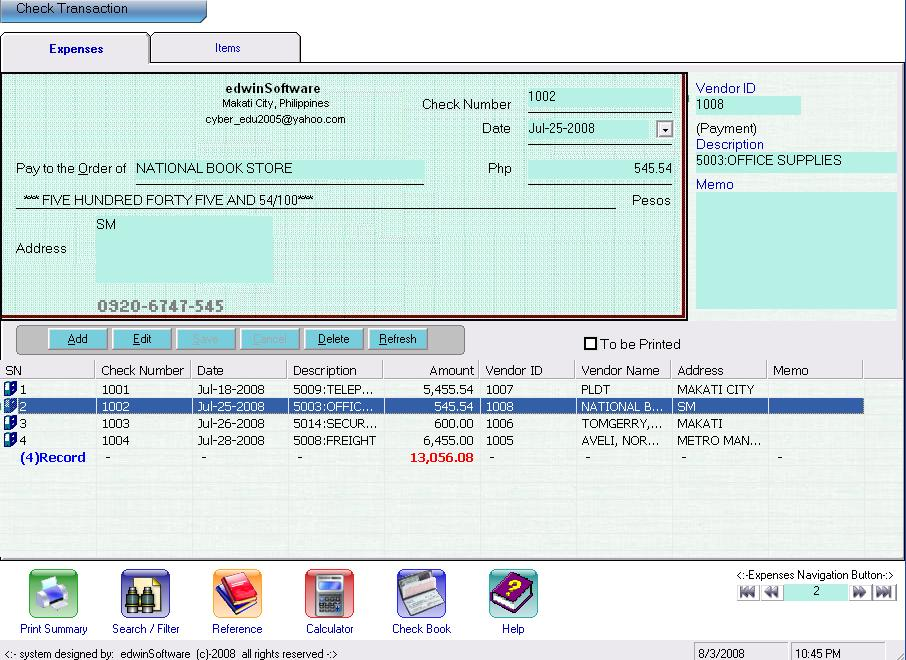



## CHECK BOOK

### Description

Check Book System: &lt;:- Freeware -:&gt; Check Book system allow you to record all check transaction within your organization. It covers Recoding of expenses, Monitoring of Checking Account , Printing or Check Voucher, Printing of Summary Report, Recording of References (Vendor and Expenses Account), and Inquiry.
 
### More Info
 

             |
---                |---
**Submitted On**   |2008-08-03 01:23:14
**By**             |[EDWIN O\. DELOS SANTOS](https://github.com/Planet-Source-Code/PSCIndex/blob/master/ByAuthor/edwin-o-delos-santos.md)
**Level**          |Intermediate
**User Rating**    |5.0 (10 globes from 2 users)
**Compatibility**  |VB 6\.0
**Category**       |[Databases/ Data Access/ DAO/ ADO](https://github.com/Planet-Source-Code/PSCIndex/blob/master/ByCategory/databases-data-access-dao-ado__1-6.md)
**World**          |[Visual Basic](https://github.com/Planet-Source-Code/PSCIndex/blob/master/ByWorld/visual-basic.md)
**Archive File**   |[CHECK\_BOOK212257832008\.zip](https://github.com/Planet-Source-Code/edwin-o-delos-santos-check-book__1-70920/archive/master.zip)

